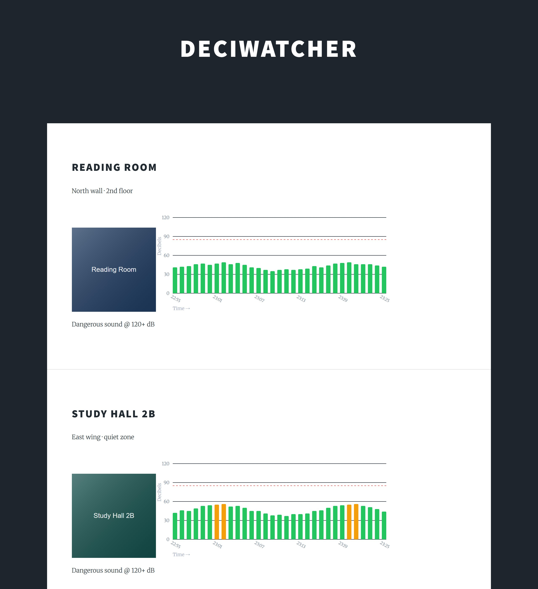

<div align="center">

# 🔊 DeciWatcher

**Distributed ambient noise monitoring for shared workspaces**

[](https://spilloid.github.io/Deciwatcher/)
[](LICENSE)
[](https://nodejs.org)
[](https://reactjs.org)
[](https://vitejs.dev)
[](https://www.arduino.cc)
[](https://www.mysql.com)

*Plug a sensor into any outlet, open the dashboard, and instantly see which corner of the library is actually quiet.*

**Status:** working end-to-end prototype from a 2019 IUPUI senior capstone; frontend modernized to Vite + React 18 in 2026. LAN-only — no authentication yet. See [Project status](#project-status).



</div>

---

## What it does

DeciWatcher is a plug-and-play IoT system that maps real-time noise levels across a physical space. Small ESP8266 sensor nodes — about the size of a USB stick — sit around a room and continuously sample ambient decibels. Every minute each node ships its averaged reading to a central Express API, which stores it in MySQL. A React dashboard then renders each sensor as a live bar chart so anyone can see noise history at a glance.

The original motivating use case was a university library: students picking a study spot shouldn't have to walk the floor to find a quiet one.

---

## Architecture

```
┌─────────────────────────────────────────────────────────┐
│  Physical Space (e.g. library floor)                    │
│                                                         │
│  [Sensor A]──┐                                          │
│  [Sensor B]──┼──── WiFi ────► Express API ──► MySQL     │
│  [Sensor C]──┘         POST /iot/receive                │
└─────────────────────────────────────────────────────────┘
                                    │
                              GET /client/data
                                    │
                             ┌──────▼──────┐
                             │  React UI   │
                             │  Bar Charts │
                             │  per sensor │
                             └─────────────┘
```

**Data flow per sensor, every ~60 seconds:**
1. Microphone samples analog voltage on `A0` at 1-second intervals (60 samples)
2. Each sample is converted to dB via a calibrated linear formula
3. The 60-sample average is POSTed to the backend with the device's MAC address
4. Backend looks up the sensor by MAC, writes the reading to `DBReadings`
5. Dashboard fetches all sensor histories via a single JOIN query and renders charts

---

## Hardware

| Component | Notes |
|-----------|-------|
| **ESP8266** (NodeMCU / Wemos D1 Mini) | Main MCU — handles WiFi and HTTP |
| **KY-038 condenser microphone** | Analog output → `A0` pin |
| 5V micro-USB power supply | Any phone charger works |

The microphone's raw ADC output is linearized to decibels using a regression formula derived from comparing the KY-038 against a reference sound level meter:

```
dB = (analogRead(A0) + 83.2073) / 11.003
```

> The regression constants were adapted from Raj, A. (2018). *"Measure Sound/Noise Level in dB with Microphone and Arduino."* [Circuit Digest](https://circuitdigest.com/microcontroller-projects/arduino-sound-level-measurement).

---

## Project structure

```
Deciwatcher/
├── backend/
│   ├── src/
│   │   ├── app.js                  # Express entry point
│   │   ├── tools/connection.js     # MySQL connection pool (reads from .env)
│   │   └── routers/
│   │       ├── iotRouter.js        # POST /iot/receive — ingest sensor packets
│   │       ├── frontRouter.js      # GET  /client/data — serve dashboard data
│   │       └── adminRouter.js      # PUT/POST /admin/*  — manage sensors
│   ├── .env.example                # ← copy to .env and fill in credentials
│   ├── dbBackup.sql                # Database schema + sample data
│   └── package.json
├── frontend/
│   ├── index.html                  # Vite entry HTML
│   ├── vite.config.js              # Dev server + /client, /iot, /admin proxy
│   ├── src/
│   │   ├── main.jsx                # React 18 entry (createRoot)
│   │   ├── App.jsx                 # Main component — fetches & renders sensor cards
│   │   └── NoiseChart.jsx          # Dependency-free inline-SVG bar chart
│   └── package.json
├── docs/                           # GitHub Pages site
│   ├── index.html                  # Public landing page
│   ├── assets/screenshots/         # Captured product media
│   └── scripts/
│       └── capture-product-media.mjs   # Playwright screenshot script
└── iot/
    └── main/main.ino               # ESP8266 firmware
```

---

## Quick start

### Prerequisites

- Node.js 18+
- MySQL 5.7+ (or MariaDB 10.3+)
- Arduino IDE with **ESP8266** board package installed

### 1 — Database

```sql
-- Create the database and import the schema
mysql -u root -p -e "CREATE DATABASE capstone;"
mysql -u root -p capstone < backend/dbBackup.sql
```

### 2 — Backend

```bash
cd backend
cp .env.example .env        # then edit .env with your DB credentials
npm install
npm start                   # or: npm run dev  (nodemon auto-reload)
# → Listening on port 3001
```

**`.env` values:**

| Variable | Description | Default |
|----------|-------------|---------|
| `PORT` | Backend HTTP port | `3001` |
| `DB_HOST` | MySQL hostname | `localhost` |
| `DB_USER` | MySQL username | — |
| `DB_PASSWORD` | MySQL password | — |
| `DB_NAME` | Database name | `capstone` |

### 3 — Frontend

```bash
cd frontend
npm install
npm run dev                 # Vite dev server with hot reload
# → http://localhost:3000
```

The dev server proxies `/client`, `/iot`, and `/admin` to `http://localhost:3001`. If your
backend runs elsewhere, set the target once via env var:

```bash
VITE_BACKEND_URL=http://192.168.0.177:3001 npm run dev
```

Build the static production bundle with `npm run build` (output in `frontend/build/`) and
preview it with `npm run preview`.

### 4 — Firmware

1. Open `iot/main/main.ino` in Arduino IDE
2. Edit the three `#define` lines at the top:

```cpp
#define SSID        "YourNetworkSSID"
#define WIFIPWD     "YourNetworkPassword"
#define BACKEND_URL "http://<your-server-ip>:3001/iot/receive"
```

3. Select **Tools → Board → NodeMCU 1.0 (ESP-12E Module)** (or your variant)
4. Flash the sketch — the serial monitor will confirm WiFi connection and each HTTP POST

### 5 — Register a sensor

Before a device will store readings it needs a row in `IoTSensors` with its MAC address. Use the admin API:

```bash
curl -X POST http://localhost:3001/admin/iot \
  -H "Content-Type: application/json" \
  -d '{"name":"Reading Room","location":"North wall","picture":null}'
```

Then update the `MAC` column directly in MySQL (or add a PATCH endpoint) with the MAC printed by the device on first boot.

---

## API reference

### `POST /iot/receive`
Ingests a decibel packet from a sensor node.

```json
{ "mac": "AA:BB:CC:DD:EE:FF", "data": "52" }
```

| Status | Meaning |
|--------|---------|
| `200` | Reading stored |
| `400` | Missing `mac` or `data` field |
| `404` | MAC not registered in `IoTSensors` |
| `500` | Database error |

---

### `GET /client/data`
Returns all active sensors and their complete reading histories.

```json
{
  "sensors":  [{ "MAC": "...", "SensorName": "...", "Location": "...", "Picture": "..." }],
  "readings": [{ "MAC": "...", "Decibels": 52, "Time": "2024-04-01T14:32:00Z" }]
}
```

---

### `PUT /admin/title` · `/admin/location` · `/admin/picture`
Update a sensor's display metadata.

```json
{ "sid": 1, "data": "New Name" }
```

### `POST /admin/iot`
Register a new sensor. Supply `name`, `location`, and optionally `picture` (blob).

### `PUT /admin/iot`
Toggle a sensor's active status.

```json
{ "sid": 1, "set": 0 }
```

---

## Noise level reference

| Range | Environment |
|-------|-------------|
| 30–45 dB | Quiet library, whispered conversation |
| 45–55 dB | Recommended office background noise |
| 55–70 dB | Normal conversation, busy café |
| 70–85 dB | Loud office, approaching harmful range |
| **120+ dB** | **Threshold of pain — immediate risk** |

> *Sources: Craven (2018), Droumeva (2017), Pope (2018) — see `Final Report.pdf` for full citations.*

---

## Project status

Honest maturity of each piece — no roadmap theatre.

| Subsystem | Status | Notes |
|-----------|--------|-------|
| Sensor firmware (ESP8266) | **Stable** | Samples, calibrates, and POSTs a reading every ~60s. WiFi creds hardcoded. |
| Ingest API `POST /iot/receive` | **Stable** | Validates packet, resolves sensor by MAC, writes to MySQL. |
| Dashboard (React 18 + Vite) | **Stable** | Fetches `GET /client/data` and renders per-location charts. Zero known-vulnerable deps in the shipped bundle. |
| Admin API (rename/relocate/toggle) | **API only** | Endpoints work and are documented; no dashboard UI drives them yet. |
| Authentication | **Planned** | None today — LAN-only. |
| Data retention | **Planned** | `DBReadings` grows unbounded; no archival job. |
| WiFi provisioning companion app | **Planned** | React Native SoftAP setup was in the original proposal, cut for time. Not started. |

---

## Known limitations

- **Hardcoded WiFi credentials** — the firmware requires a reflash to change networks. A BLE or SoftAP config page (planned companion app) would fix this.
- **No data retention policy** — `DBReadings` grows unbounded. A scheduled job to archive or downsample old rows is needed at scale.
- **No authentication** — the admin endpoints are open on the local network. Suitable for a closed LAN; not for public deployment without adding auth middleware.
- **Read-only dashboard** — the UI shows historical charts but cannot manage sensors; the admin endpoints exist on the backend but have no UI yet.

---

## Docs & screenshots

The public landing page lives in [`docs/index.html`](docs/index.html) (served via GitHub Pages).
Product screenshots under [`docs/assets/screenshots/`](docs/assets/screenshots/) are regenerated
from the real UI with realistic mocked data:

```bash
# one-time: install Playwright + Chromium in a scratch dir
npm install --prefix "$TEMP/deciwatcher-playwright" playwright
npx --prefix "$TEMP/deciwatcher-playwright" playwright install chromium
export PLAYWRIGHT_NODE_MODULES="$TEMP/deciwatcher-playwright/node_modules"

# capture (builds the frontend, serves it, screenshots the dashboard)
node docs/scripts/capture-product-media.mjs
```

---

## License

[MIT](LICENSE) — 2019 Joseph Spillers
